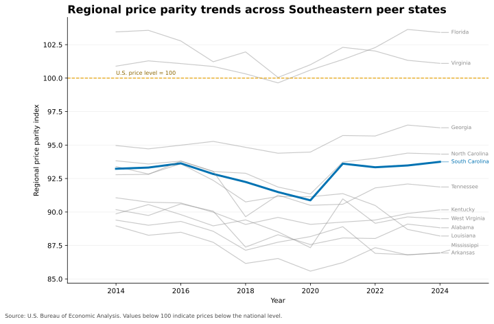
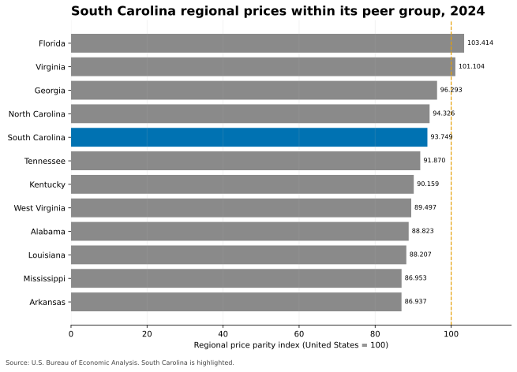
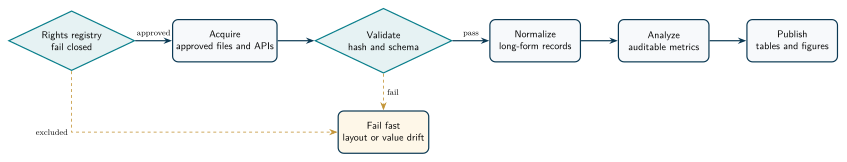

# South Carolina education finance analysis

This repository is a recruiter-facing case study in reliable data engineering.

The current public release analyzes regional price parities for South Carolina and 11 Southeastern peer states.

The pipeline uses only the U.S. Bureau of Economic Analysis source approved by the repository's rights policy.

Other education sources remain excluded until the exact publication protocol receives written permission or qualified legal approval.

This project is a conventional ETL system.

It demonstrates production controls that also matter in Agentic AI software engineering.

Those controls include guarded external access, explicit permissions, deterministic tool execution, validation, and audit trails.

## Current findings

- South Carolina's 2024 regional price parity was 93.749.
- That index places South Carolina fifth-highest among the 12 peer states in this analysis.
- South Carolina's index was 6.251 points below the national price level of 100.
- The state's index increased from 93.231 in 2014 to 93.749 in 2024.
- South Carolina's 2024 RPP for services other than housing and utilities was 98.284.
- Florida had the peer group's highest 2024 index at 103.414. Arkansas had the lowest at 86.937.

The peer rankings and trends use the all-items series.

These results describe relative price levels.

They do not report teacher pay, school spending, staffing, enrollment, or assessment outcomes.

## Current figures





## Engineering architecture



The Python package separates acquisition, rights decisions, schema validation, normalization, analysis, and publication.

The source registry is policy as code.

It denies publication when a source is unknown, lacks a rights URL, or has not received affirmative approval.

Every approved download records its URL, retrieval time, release, content type, and SHA-256 digest.

The normalized table has one row for each geography, year, and metric.

The build stops on missing columns, malformed values, duplicate state rows, incomplete peer coverage, or a manifest hash mismatch.

## Reproduce the release

Use Python 3.11 or later.

`build` and `check` are offline and use the committed BEA snapshot.

```bash
git clone https://github.com/nathanielecon/sc-education-finance-analysis.git
cd sc-education-finance-analysis
uv sync --extra dev
uv run sc-education-finance build
uv run sc-education-finance check
```

Standard `pip` installation is also supported.

```bash
python -m venv .venv
python -m pip install -e ".[dev]"
python -m sc_education_finance build
python -m sc_education_finance check
```

`fetch` requests only approved sources.

`refresh` runs `fetch` and `build`.

Live refreshes belong in the manual GitHub Actions workflow because they use the network.

## Data quality and delivery controls

The project demonstrates Python, ETL, a tested data pipeline, ZIP and CSV extraction, schema validation, reproducible analysis, data lineage, and deterministic visualization.

The test suite exercises generic PDF, HTML, CSV, and workbook adapters only with invented fixtures.

pytest covers transformations, rank ties, manifest hashing, source-rights decisions, schema failures, and integration adapters.

GitHub Actions runs Ruff, mypy, pytest, generated-output drift checks, secret scanning, dependency vulnerability checks, dependency-license reporting, and Markdown link validation.

Normal CI is offline.

The manual refresh workflow is the only workflow that requests live source data.

## Technology

Python · pandas · Matplotlib · pytest · Ruff · mypy · uv · GitHub Actions · TikZ

These tools support ETL, test automation, CI/CD, data governance, and auditable release workflows.

## Sources, rights, and license

The public data come from the [BEA regional price parity archive](https://apps.bea.gov/regional/zip/SARPP.zip).

BEA states that its website information is public domain unless otherwise noted, and it requests attribution in reuses. See the [BEA copyright FAQ](https://www.bea.gov/help/faq/147).

The MIT License covers original code only.

It does not license third-party data, names, marks, or external assets.

Read [DATA_SOURCES.md](DATA_SOURCES.md), [SOURCE_EXCLUSIONS.md](SOURCE_EXCLUSIONS.md), [THIRD_PARTY_NOTICES.md](THIRD_PARTY_NOTICES.md), and [LEGAL_POLICY_REVIEW.md](LEGAL_POLICY_REVIEW.md) before adding a source.

See the [detailed findings and methodology](docs/findings.md).
