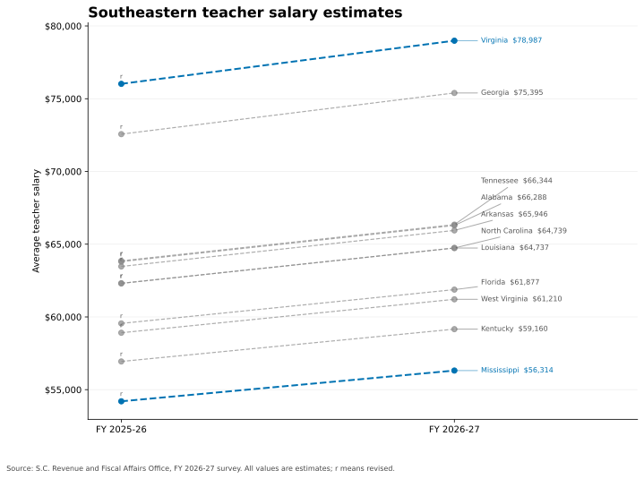
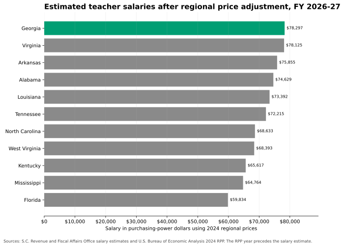

# South Carolina teacher salary and regional cost analysis

This project compares South Carolina teacher salaries with the Southeastern average and 11 nearby states. It combines selected salary facts from the RFA FY 2026-27 survey with BEA regional price parity data through 2024. The latest South Carolina figure is an actual salary for FY 2024-25. The survey classifies the FY 2025-26 and FY 2026-27 peer-state figures as estimates.

## Findings

- South Carolina's FY 2024-25 actual average teacher salary was $64,050. The corresponding Southeastern estimate was $61,749.
- South Carolina's actual salary was $2,301, or 3.7%, above that regional estimate.
- The reported Southeastern averages for FY 2025-26 and FY 2026-27 are estimates of $63,085 and $65,545.
- Virginia has the highest FY 2026-27 peer estimate at $78,987. Mississippi has the lowest at $56,314.
- Georgia has the highest adjusted FY 2026-27 estimate at about $78,297. This calculation uses each state's 2024 BEA price level.

## Salary figures


Source: [S.C. Revenue and Fiscal Affairs Office FY 2026-27 survey](https://www.rfa.sc.gov/media/11403). The dashed segment contains estimates.



Source: [S.C. Revenue and Fiscal Affairs Office FY 2026-27 survey](https://www.rfa.sc.gov/media/11403). Every value in this figure is an estimate. The letter `r` marks a revised estimate.



Sources: [RFA teacher salary survey](https://www.rfa.sc.gov/media/11403) and [BEA regional price parity archive](https://apps.bea.gov/regional/zip/SARPP.zip). The latest available BEA year is 2024, which precedes the salary estimate.

## Regional price figures


## Pipeline

The Python package runs an ETL data pipeline for acquisition, PDF and CSV extraction, schema validation, normalization, analysis, and publication. Each download has a manifest entry with its URL, retrieval time, release, content type, and SHA-256 hash. The pipeline checks source permissions before it downloads or publishes data. It stops when a source layout changes. It also stops for missing values, duplicate state-year rows, incomplete peer coverage, or mismatched snapshot hashes.


## Reproduce the results

Use Python 3.11 or later. `build` and `check` run offline from the committed factual snapshots.

```bash
git clone https://github.com/nathanielecon/sc-education-finance-analysis.git
cd sc-education-finance-analysis
uv sync --extra dev
uv run sc-education-finance build
uv run sc-education-finance check
```

Standard `pip` installation is also supported.

```bash
python -m venv .venv
python -m pip install -e ".[dev]"
python -m sc_education_finance build
python -m sc_education_finance check
```

The command-line interface has four commands:

- `fetch` downloads approved source files and refreshes their factual snapshots.
- `build` processes the snapshots and creates the tables and figures.
- `refresh` runs `fetch` and `build`.
- `check` rebuilds the outputs and fails if committed results differ.

## Tests and delivery

pytest covers calculations, state-name normalization, source parsing, revision labels, schema failures, rank ties, hashes, and file adapters. The integration test uses invented PDF, HTML, CSV, and workbook files. GitHub Actions provides test automation and CI/CD. It runs Ruff, mypy, pytest, output drift checks, secret scanning, dependency audits, license reporting, and Markdown link validation. Regular CI stays offline, while a manual workflow performs live source refreshes.

The project uses Python, pandas, Matplotlib, pytest, Ruff, mypy, uv, GitHub Actions, and TikZ.

## Methods and source use

The purchasing-power calculation is `nominal salary / (RPP / 100)`. The pipeline keeps full precision for calculations and rounds only chart and table values. RFA marks the FY 2024-25 through FY 2026-27 regional values as estimates. A separate revision flag preserves the survey's `r` notation. The Southeastern averages shown here are the published survey averages.

The repository excludes the RFA PDF and its table. It stores selected factual salary values. MIT covers the original code and charts. It does not license the RFA publication, BEA names, agency marks, or other third-party material.

See [detailed findings and methodology](docs/findings.md), [data sources](DATA_SOURCES.md), and [third-party notices](THIRD_PARTY_NOTICES.md).
