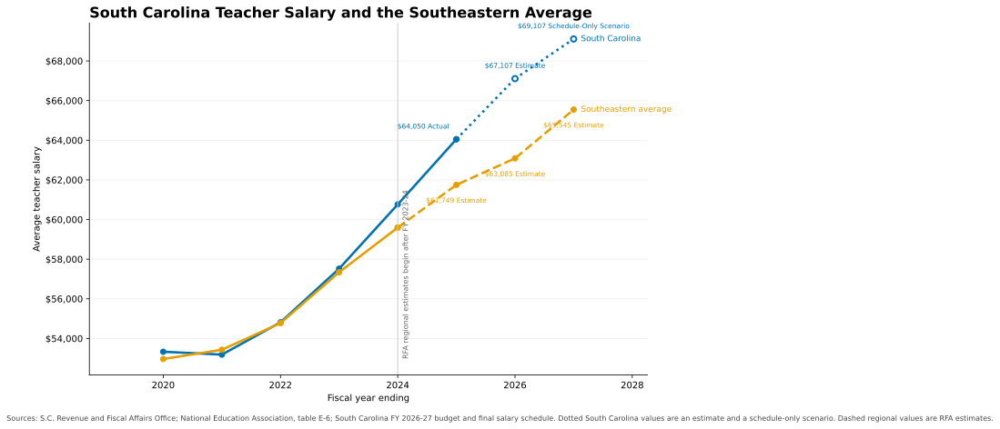
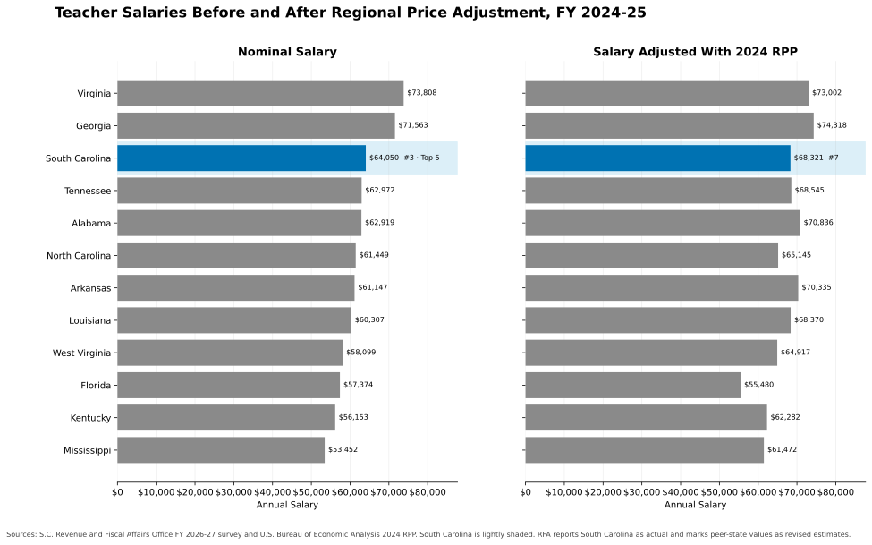
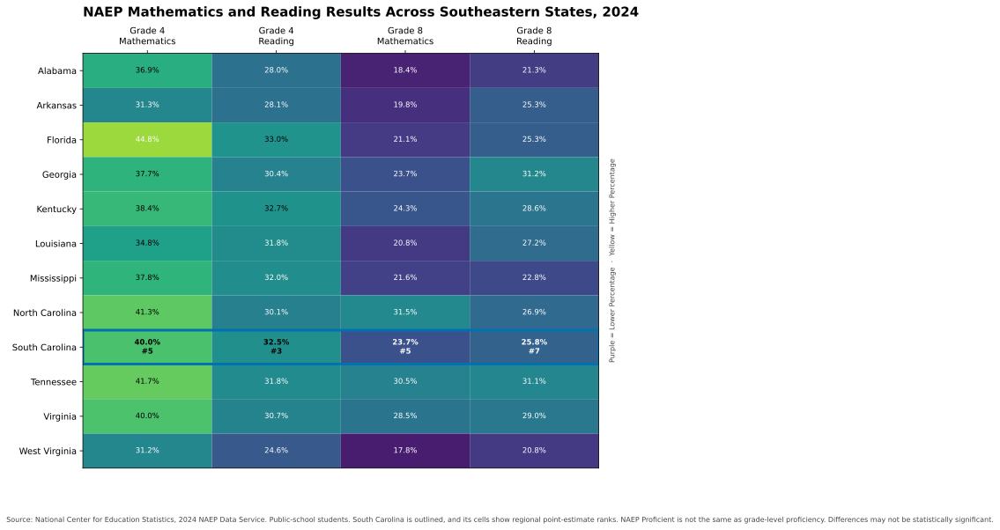

# South Carolina Teacher Salary, Purchasing Power, and NAEP Analysis

This project compares South Carolina teacher pay with 11 Southeastern states. It puts nominal salary beside purchasing power and adds 2024 NAEP mathematics and reading results. The matched state comparison uses FY 2024–25 salaries and 2024 BEA regional price parities. Other inputs include May 2025 BLS wages and the 2024 NAEP assessment.

## Key Findings

- South Carolina's actual average teacher salary was $64,050 in FY 2024–25. The corresponding Southeastern survey estimate was $61,749.
- South Carolina ranked third among the 12 states in nominal salary. Its 2024 RPP-adjusted salary was about $68,321, which ranked seventh.
- NEA estimated South Carolina's FY 2025–26 average at $67,107. The FY 2026–27 schedule-only scenario adds the enacted $2,000 increase to that estimate. The result is $69,107.
- South Carolina ranked fifth in Grade 4 mathematics and third in Grade 4 reading. It ranked fifth in Grade 8 mathematics and seventh in Grade 8 reading.
- The May 2025 BLS median was $60,820 for elementary teachers and $60,810 for middle school teachers. The secondary teacher median was $62,580. These occupational estimates should not replace the statewide average classroom-teacher series.

## Salary Trend and Scenario



South Carolina's line is solid through the FY 2024–25 actual. The dotted extension reaches the external NEA estimate of $67,107 for FY 2025–26. The hollow final marker is the project-calculated $69,107 schedule-only scenario for FY 2026–27.

The scenario adds the enacted $2,000 schedule increase to the NEA estimate. It is not an official projection from South Carolina, NEA, or RFA. Teacher composition, experience, district supplements, and turnover can make the eventual statewide average differ.

Sources: [RFA FY 2026–27 survey](https://www.rfa.sc.gov/media/11403), [NEA August 2026 report, table E-6](https://www.nea.org/sites/default/files/2026-08/2026-rankings-and-estimates-report-august-update.pdf), [South Carolina FY 2026–27 budget](https://www.scstatehouse.gov/sess126_2025-2026/appropriations2026/gab5126.php), and [SCDE teacher salary schedules](https://ed.sc.gov/finance/financial-data/historical-data/teacher-salary-schedules/).

## Nominal and RPP-Adjusted Salaries



The two panels use the same state order and dollar scale. This makes the effect of regional prices visible without changing the comparison period. The matched table does not use South Carolina's later estimate or scenario.

Sources: [RFA teacher salary survey](https://www.rfa.sc.gov/media/11403) and [BEA regional price parity archive](https://apps.bea.gov/regional/zip/SARPP.zip). RFA identifies South Carolina's value as actual and marks the 11 peer-state values as revised estimates.

## 2024 NAEP Regional Comparison



The heatmap uses aggregate results for public-school students. South Carolina's Grade 4 percentages were 40.0% in mathematics and 32.5% in reading. Its Grade 8 percentages were 23.7% in mathematics and 25.8% in reading. The ranks describe point estimates only. Differences between states may not be statistically significant. NAEP Proficient is not the same as state-defined grade-level proficiency.

Source: [NAEP Data Service](https://www.nationsreportcard.gov/api_documentation.aspx).

## South Carolina BLS Occupational Wages

The BLS OEWS release has separate mean and median wage estimates for three teacher occupations. The estimates refer to May 2025 and cover wage and salary workers in each occupation across covered employers.

| SOC | Occupation | Mean | Median |
| --- | --- | ---: | ---: |
| 25-2021 | Elementary School Teachers, Except Special Education | $62,210 | $60,820 |
| 25-2022 | Middle School Teachers, Except Special and Career/Technical Education | $62,580 | $60,810 |
| 25-2031 | Secondary School Teachers, Except Special and Career/Technical Education | $65,340 | $62,580 |

BLS defines the mean as the average across workers in an occupation. The median splits the wage distribution in half. Neither measure is an FY 2025–26 projection or a direct substitute for RFA's statewide average teacher salary.

Source: [BLS May 2025 OEWS tables](https://www.bls.gov/oes/tables.htm). BLS published the release on May 15, 2026.

## Regional Price Figures


South Carolina's 2024 all-items RPP was 93.749. An RPP of 100 equals the national price level for that year.

## Latest-Available Salary Table

[`latest-available-teacher-salaries.csv`](data/curated/latest-available-teacher-salaries.csv) selects the latest official actual in the approved data before it uses an RFA estimate. South Carolina therefore appears with its FY 2024–25 actual. The other states use FY 2026–27 RFA estimates because no approved official actual is present for them. The table is not ranked because its years and statuses are mixed.

## Data Pipeline

The Python ETL data pipeline acquires approved files and API results. It applies schema validation and coverage rules, normalizes records, calculates the analysis, and renders the figures. Each downloaded source has a URL, retrieval time, release label, content type, and SHA-256 hash in the source manifest. The build stops for missing columns, duplicate records, incomplete peer coverage, invalid statuses, non-displayable NAEP values, or mismatched snapshot hashes.


The normalized records include `source`, `source_release`, `geography`, `year`, `period`, `metric`, `value`, `unit`, `status`, `is_revised`, and `rpp_year`. Modeled records also include `method`, `input_source_ids`, and `assumptions`.

## Reproduce the Results

Use Python 3.11 or later. The ordinary build and validation run offline from the committed selected-data snapshots.

```bash
git clone https://github.com/nathanielecon/sc-education-finance-analysis.git
cd sc-education-finance-analysis
uv sync --extra dev
uv run sc-education-finance build
uv run sc-education-finance check
```

Standard `pip` installation is also supported.

```bash
python -m venv .venv
python -m pip install -e ".[dev]"
python -m sc_education_finance build
python -m sc_education_finance check
```

The command-line interface has four commands:

- `fetch` downloads approved live sources and refreshes their factual snapshots.
- `build` validates the snapshots and creates the tables and figures.
- `refresh` runs `fetch` and `build`.
- `check` rebuilds the outputs and fails when committed results are stale.

## Quality Controls

pytest provides test automation. The tests cover calculations, source priority, state normalization, scenario derivation, parsing, revision labels, NAEP coverage, schema failures, rank ties, hashes, and invented fixtures. GitHub Actions provides CI/CD for Ruff, mypy, pytest, output-drift comparison, secret scanning, dependency auditing, license reporting, prose linting, and Markdown link validation. Regular CI stays offline. The manually triggered refresh workflow is the only workflow that requests live data.

The stack includes Python, pandas, Matplotlib, pytest, Ruff, mypy, uv, GitHub Actions, and TikZ.

## Methods and Source Notes

Purchasing power is `nominal salary / (RPP / 100)`. Calculations retain full precision, while tables and charts round presentation values. The repository stores selected facts and original figures, not the RFA or NEA source documents or their table designs.

MIT covers the original code and charts. It does not license third-party publications, names, trademarks, or external assets. GlobalCybers and USAFacts helped locate official sources. The repository does not include their content or presentation.

See [Detailed Findings and Methodology](docs/findings.md), [Data Sources](DATA_SOURCES.md), and [Third-Party Notices](THIRD_PARTY_NOTICES.md).
